# page2cirucit

The objective of a page2circuit is to automate the converion a hand drawn circuit image into digitally generated schematics. The software is primarily developed in Python and currently hosted on Streamlit platform; one can try it out here --> [page2circuit](https://gadhvirushiraj-page2circuit-webapp-hvznh0.streamlit.app/)

---

# p2c in LIVE ACTION

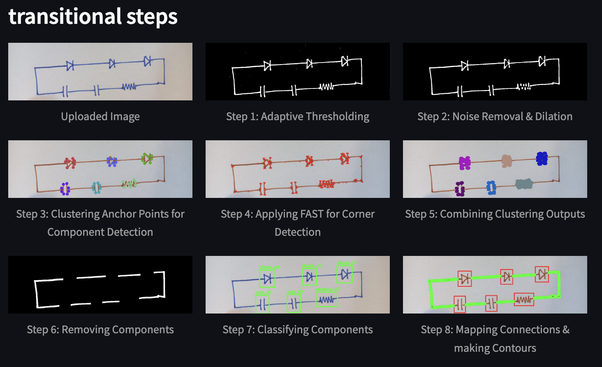

## How does it work ?

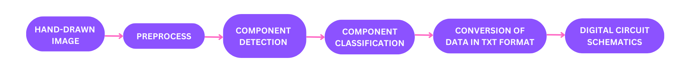

---

### **Input Image**

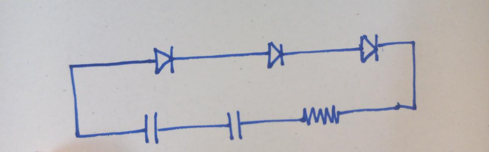

---

### **STEP 1**

To begin with, we convert the user's image to grayscale and then apply thresholding. However, a drawback of traditional thresholding methods is that they rely on a fixed threshold value to distinguish between foreground and background pixels. This approach becomes problematic when the input image has uneven lighting or varying illumination conditions, as finding a single global threshold that suits the entire image becomes challenging. Adaptive thresholding solves this problem by effectively dealing with illumination variations and yielding improved segmentation outcomes in such scenarios.

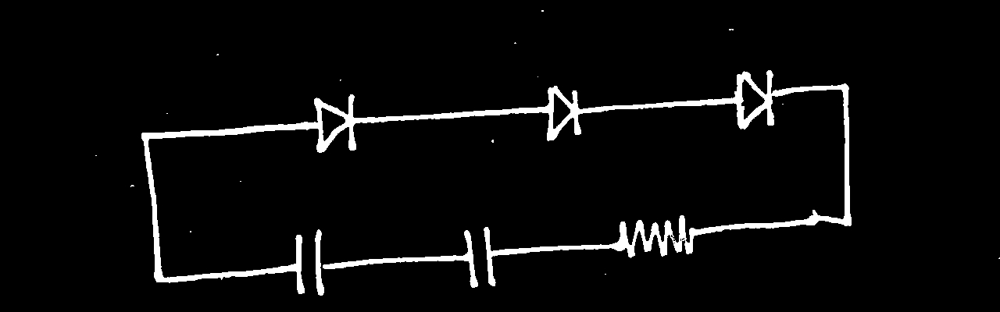

---

### **STEP 2**

Moving forward, it is important to consider that the paper on which the user draws the circuit might contain unintended marks, stains, or other artifacts. These unwanted elements can introduce noise into the image, making it challenging to accurately detect components during the subsequent stages of circuit analysis. To address this issue, we can apply an opening operation to the thresholded image.

By performing an opening operation, we employ a morphological technique that combines erosion followed by dilation operations on the image. The primary objective is to eliminate small objects, noise, and fine details that could hinder component detection. Simultaneously, the opening operation preserves the overall structure of larger objects, ensuring that the essential features of the circuit remain intact.

We also perform an additional dilation, this operation helps to bridge any small gaps that may have been inadvertently left by the user while drawing the circuit. It ensures that the individual components or traces that should have been connected are merged into a single, continuous object.

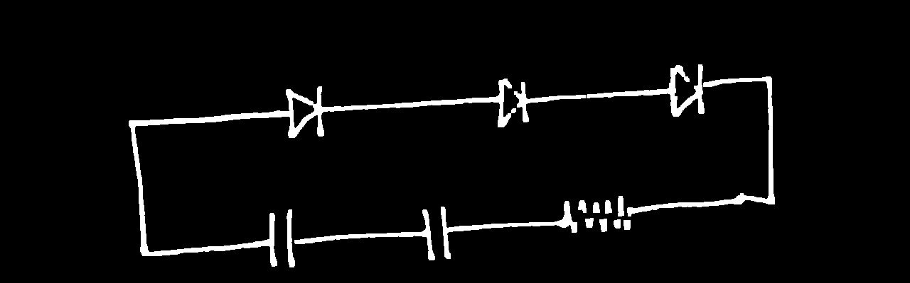

---

### **STEP 3**

After reducing the noise in the images, we can proceed with the Shi-Tomasi corner detection algorithm, which is an improvement over the Harris corner detection algorithm. OpenCV provides a convenient function called `goodFeaturesToTrack()` that makes it easy to apply this algorithm.

Once we obtain the anchor points from the algorithm, the next step is to apply the `DBSCAN (Density-Based Clustering Algorithm)` clustering algorithm. The goal of clustering is to group together points that are close to each other. In our case, each cluster represents a component in the circuit.During the clustering process, we set a minimum threshold for the number of points required within a cluster. If a cluster fails to meet this threshold, it is removed. This helps ensure that we only consider meaningful clusters. To visualize the clusters, different colors are used to mark each cluster in the image. This allows us to easily distinguish between different components in the circuit.

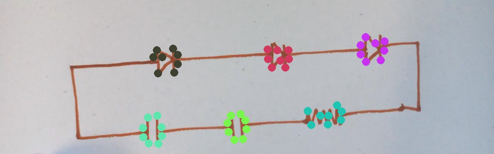

---

### **STEP 4**

The clusters created earlier serve as markers for the components. However, the plotted points do not fully cover the entire component. This becomes crucial during component extraction, as we want to avoid situations where the bounding box only encompasses only a portion of the component. To address this, we employ an alternative method of corner detection. In this case, we set parameters for a more aggressive approach using the `FAST (Features from Accelerated Segment Test)` corner detection algorithm. As the name suggests, this algorithm is specifically designed to rapidly and efficiently detect corners in an image.

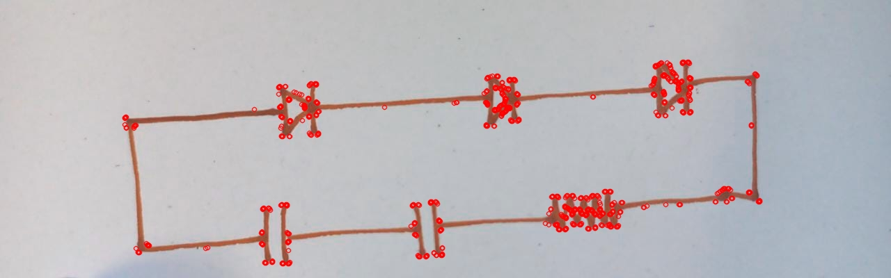

---

### **STEP 5**

To further refine our clustering results, we integrate the initial clusters with the anchor points obtained through the FAST algorithm. We adopt a criterion where if a point is in close proximity to the mean coordinates of a cluster, it is included in that cluster; otherwise, it is discarded. This approach ensures that we have an adequate number of points within each cluster. By incorporating this step, we can minimize the risk of missing any portion of a component when removing it from the image. As depicted in the image, the new clusters exhibit a significant improvement, covering a larger portion of the components and exhibiting a higher density compared to the initial clusters.

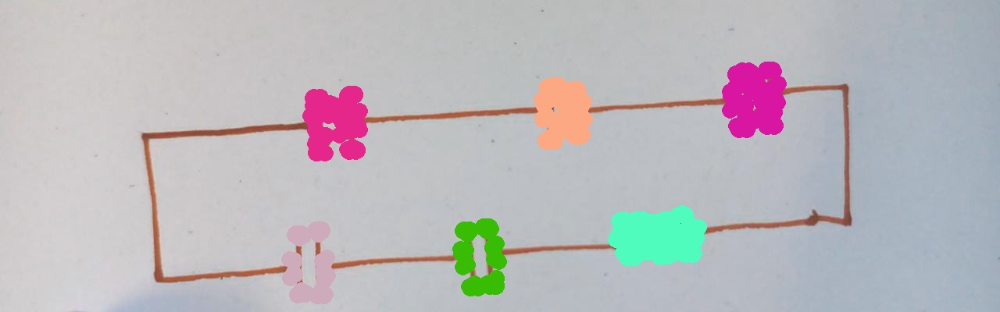

---

### **STEP 6**

During the component extraction step, we carefully analyze each cluster. We identify the points with the maximum and minimum x-coordinate values, as well as those with the maximum and minimum y-coordinate values. This information is then utilized to create a bounding box that encompasses the entire component within the cluster. This bounding box serves as a region of interest for extracting the component from the image.

The image presented showcases the result after successfully removing all the components from the original image. It is evident that no traces or remnants of any component portions remain in the image. This demonstrates the effectiveness of the component removal process in completely selecting the components from the image.

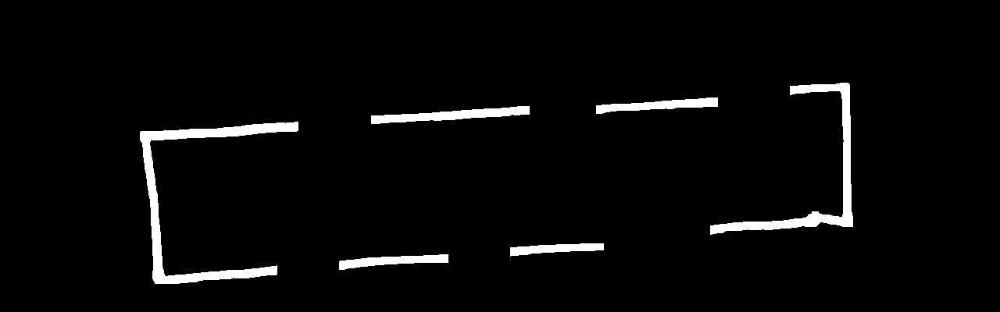

---

### **STEP 7**

After extracting the components, they are fed into a neural network model for recognition. The convolutional neural network (CNN) model was developed and trained using the pytorch library, utilizing a specific hand-drawn component dataset (~14,000 images). During training, the model achieved an impressive accuracy of 99.99% on the training set and 90.35% on the validation set.

The trained model demonstrates the ability to accurately classify and identify 11 distinct components, encompassing a total of 37 classes when accounting for variations in orientation. It can effectively differentiate between these components based on their visual characteristics, providing reliable classification results.

The extract model structure could be seen below -

```
self.con1 = nn.Conv2d(1, 32, 3, padding=1)
self.acv1 = nn.ReLU()
self.pool1 = nn.MaxPool2d(2)
self.con2 = nn.Conv2d(32, 64, 3, padding=1)
self.acv2 = nn.ReLU()
self.pool2 = nn.MaxPool2d(2)
self.con3 = nn.Conv2d(64, 32, 3, padding=1)
self.acv3 = nn.ReLU()
self.pool3 = nn.MaxPool2d(2)
self.con4 = nn.Conv2d(32, 16, 3, padding=1)
self.acv4 = nn.ReLU()
self.pool4 = nn.MaxPool2d(2)
self.lin1 = nn.Linear(16*4*4, 512)
self.act5 = nn.ReLU()
self.lin2 = nn.Linear(512, 37)
```

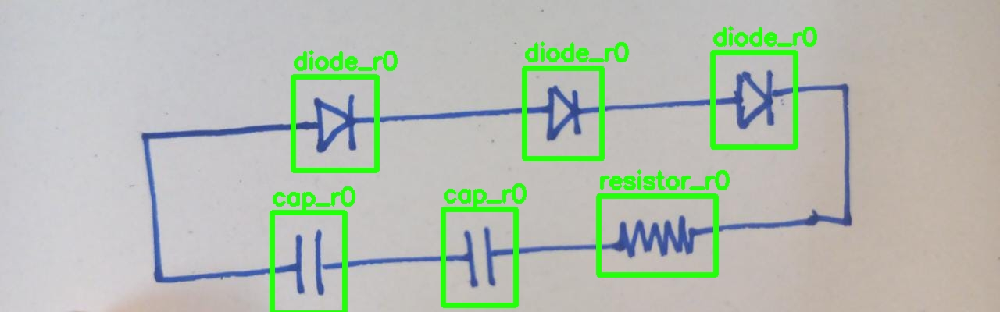

---

**STEP 8**

Following the classification process, we proceed to draw contours on the circuit image from which all components have been removed. This enables us to obtain the paths of the various wires within the circuit. However, a new challenge arises in determining the connections between components. It becomes essential to establish which component is connected to another component within the circuit. This task involves analyzing the wire paths and identifying the corresponding components at each connection point, allowing us to establish the complete circuit topology.

We extend out bounding boxes in each direction by couple of pixels and by simple coordinate geometry we check if a point in a certain contour also happens to be on or inside the bounding box, if so that contour is connected to bounding box, i.e it is connected to the component corresponding to the box.

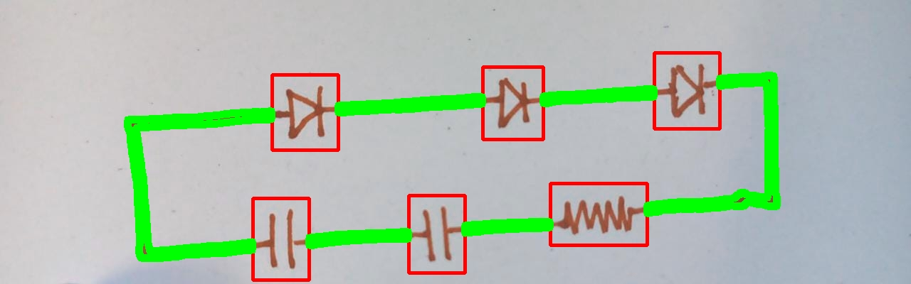

---

**STEP 9**

_Convert to .net or .sch file (yet to implement)_

---

**STEP 10**

_covert file into digital schematics
(yet to implement)_

---

**Reference**

- Inspired by, https://github.com/mahmut-aksakalli/circuit_recognizer
- Dataset, https://www.kaggle.com/datasets/altermetax/hand-drawn-circuit-elements
